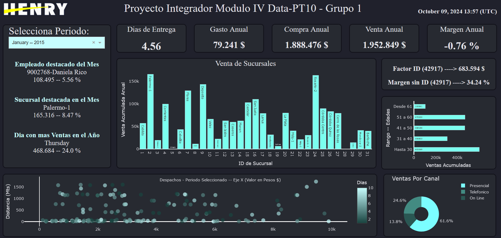
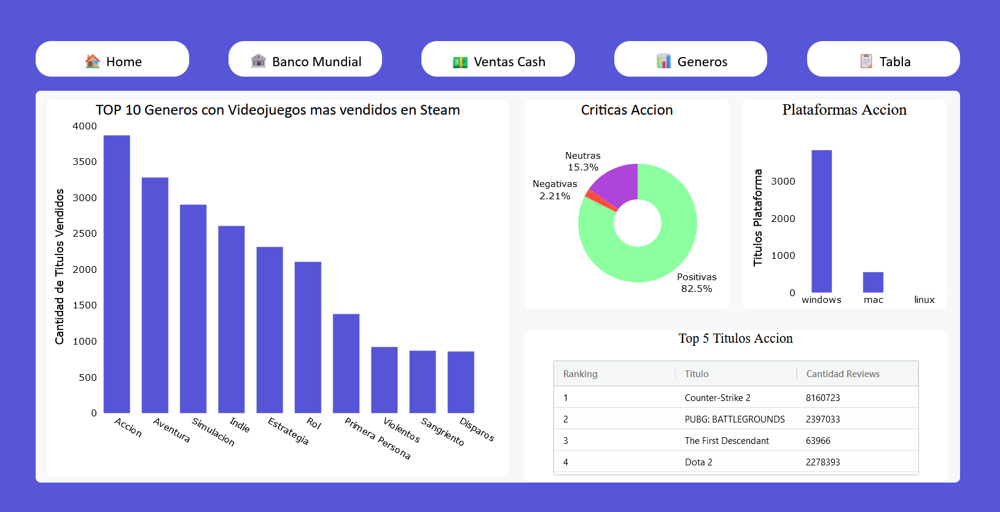
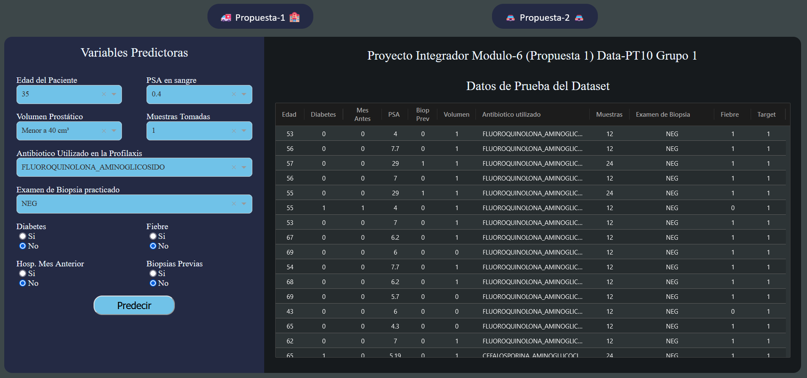
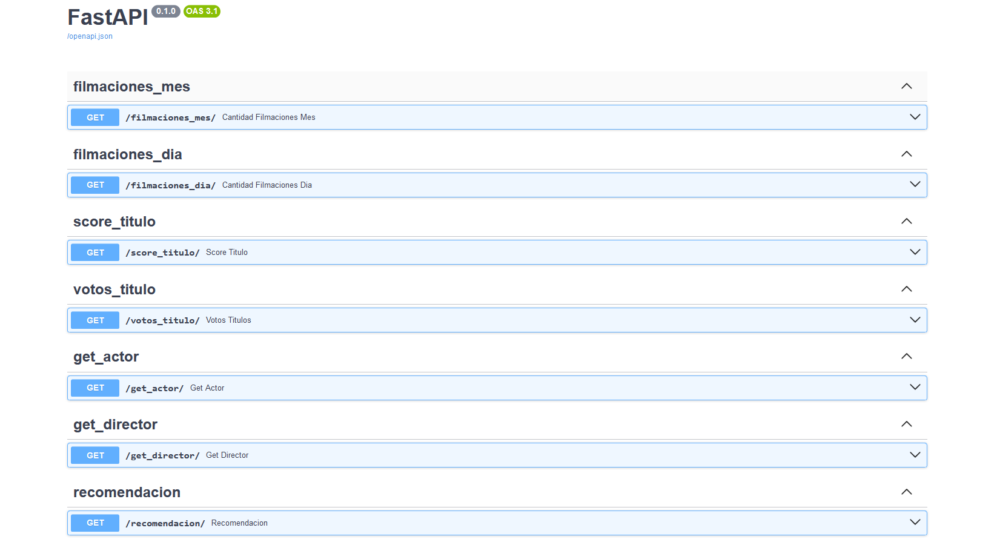
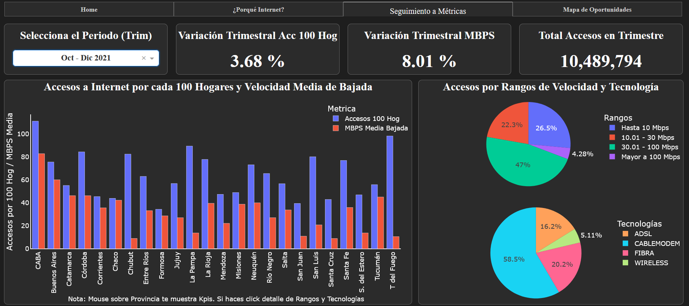
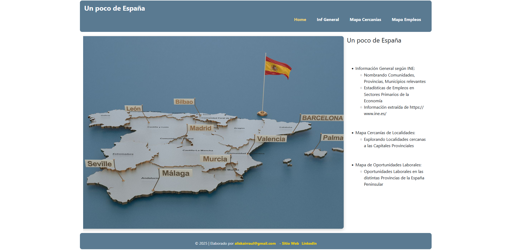

  

### Hola mi nombre es Aliskair Rodríguez 👋
aliskairraul@gmail.com 
cel: +58-4122841181 
https://www.linkedin.com/in/aliskair-rodriguez-782b3641
---

### Acerca de mi

Ingeniero en Información de carrera, mi enfoque en convertir datos en información y servir de apoyo al proceso de Toma de Decisiones. Los Ingenieros en Información fuímos formados para ser personas  interfaces entre departamentos, con nociones en procesos administrativos, manufactura y un poco mas en informática. Este último año experimenté un refrescamiento o actualización estudiando Data Science, y he visto gratamente como desde la Ingeniería de Datos hasta BI, en todas las áreas sin excepción, la CALIDAD/CANTIDAD de los datos, conociendo el contexto, es lo que garantiza la obtención de Información relevante y de calidad.

El utilizar codigo de Python en la consecusión de Objetivos profesionales, convierte el proceso en algo tan apasionante y/o entretenido como Jugar Sudoku o resolver misterios...

### Proyectos

Por favor tome en cuenta que los proyectos fueron desplegados en las capas gratuitas de distintas plataformas.  En el caso de Render los despliegues tardan 1 minuto aproximadamente en cargar, y en el caso de HuggingFace es probable de deba darle al Boton "Restart this Space" para que cargue la página.

**Click sobre la Imagen te lleva al despliegue del Proyecto**

<table>
  <tr>
    <td>
      
       
      <a href="https://github.com/aliskairraul/Bootcamp-Henry-Proyecto-Mod-4.git">Repositorio</a>
    </td>
    <td>
      
       
      <a href="https://github.com/aliskairraul/Bootcamp-Henry-Proyecto-Mod_5.git">Repositorio</a>
    </td>
  </tr>
  <tr>
    <td>
      
       
      <a href="https://github.com/aliskairraul/Bootcamp-Henry-Proyecto-Mod_6.git">Repositorio</a>
    </td>
    <td>
      
       
      <a href="https://github.com/aliskairraul/Bootcamp-Henry-Proyecto-Lab_1">Repositorio</a>
    </td>
  </tr>
  <tr>
  <td>
    
     
    <a href="https://github.com/aliskairraul/Bootcamp-Henry-Proyecto-Lab_2.git">Repositorio</a>
  </td>
  <td>
    
     
    <a href="https://github.com/aliskairraul/conociendoEspana">Repositorio</a>
  </td>
</tr>
</table>

<!--
**aliskairraul/aliskairraul** is a ✨ _special_ ✨ repository because its `README.md` (this file) appears on your GitHub profile.

Here are some ideas to get you started:

- 🔭 I’m currently working on ...
- 🌱 I’m currently learning ...
- 👯 I’m looking to collaborate on ...
- 🤔 I’m looking for help with ...
- 💬 Ask me about ...
- 📫 How to reach me: ...
- 😄 Pronouns: ...
- ⚡ Fun fact: ...
-    good luck
-->
